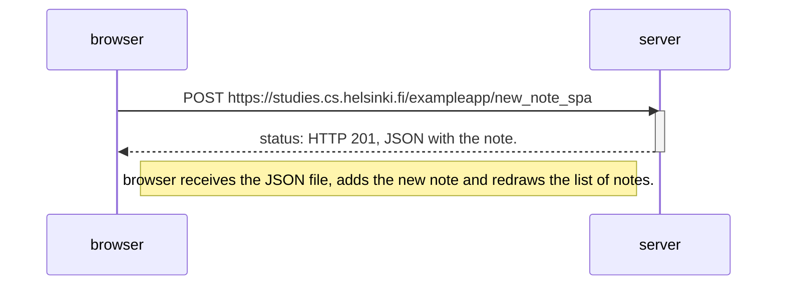

```mermaid
sequenceDiagram
    participant browser
    participant server

    browser->>server: POST https://studies.cs.helsinki.fi/exampleapp/new_note_spa
    activate server
    server-->>browser: status: HTTP 201, JSON with the note.
    deactivate server
    
    Note right of browser: browser receives the JSON file, adds the new note and redraws the list of notes.
```
